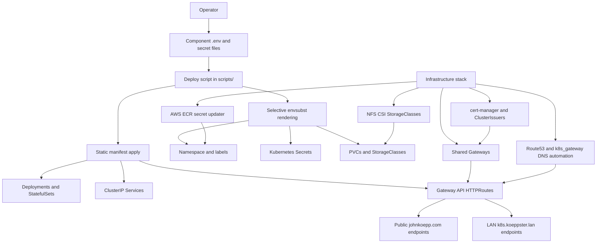

# Kubernetes Sandbox Overview

This repository captures a MicroK8s lab environment built around shell-driven Kubernetes manifests. The deployment model is deliberately simple: shared cluster foundations are created from `infrastruture/`, and each application stack owns its namespace, manifests, scripts, and local configuration.

The `infrastruture/` path is misspelled in the repository and should be treated as canonical unless a cleanup explicitly renames it everywhere.

## Deployment Model

## Shared Infrastructure

The infrastructure stack installs or configures the cluster-wide services that the app stacks depend on:

- MicroK8s addons: community, RBAC, cert-manager, MetalLB, registry, metrics-server, and KWasm.
- Envoy Gateway as the Gateway API implementation.
- NFS CSI driver and NFS-backed storage classes: `kube-nfs` and `kube-postgres`.
- `cert-manager` ClusterIssuers and the wildcard/public gateway certificate.
- `koeppster-lan-gateway` for LAN routes and `johnkoepp-com-gateway` for public HTTP/HTTPS routes.
- AWS credential propagation, ECR pull-secret refresh, and Route53 record automation.
- `k8s_gateway` for LAN DNS serving under `k8s.koeppster.lan`.

Public routes generally use an HTTPS `HTTPRoute` that forwards traffic and a paired HTTP `HTTPRoute` that redirects to HTTPS. The HTTP redirect route is usually labeled with `koeppster.net/aws_common_name` and `koeppster.net/aws_status: waiting` so the Route53 updater can discover records.

## Stack Inventory

| Stack | Namespace | Entry point | Main resources | Routes |
| --- | --- | --- | --- | --- |
| Infrastructure | `infrastructure` plus cluster namespaces | `infrastruture/create-infrastructure.sh` | Gateways, ClusterIssuers, StorageClasses, AWS DNS/ECR automation | Shared `johnkoepp-com-gateway`, `koeppster-lan-gateway` |
| n8n | `n8n` | `n8n/scripts/deploy-n8n.sh` | n8n Deployment, Postgres StatefulSet, Box MCP server, PVCs | `orchestration.johnkoepp.com` |
| Keycloak | `keycloak` | `keyclock/scripts/deploy.sh` | Keycloak Deployment, Postgres StatefulSet, PVCs | `idp.johnkoepp.com` |
| Grafana and Loki | `grafana` | `grafana+loki/scripts/deploy.sh` | Grafana Helm release, Loki Helm release, Box event collector, PVCs | `grafana.k8s.koeppster.lan`, `loki.k8s.koeppster.lan`, `grafana.johnkoepp.com` |
| Box tools | `box` | `box/scripts/deploy-quarantine.sh`, `box/scripts/deploy-redact.sh` | Quarantine StatefulSet, redaction Deployment, PVC, file secrets | `boxredact.johnkoepp.com` |
| MeshCentral | `${MESH_NAMESPACE}` from `.env`, sample `meshcentral` | `meshcentral/scripts/deploy.sh` | MeshCentral Deployment, PVC, file-based config Secret | `${MESH_HOSTNAME}` |
| Jenkins | `jenkins` | `jenkins/build-jenkins.sh` and `jenkins/jenkins-resources.yaml` | Jenkins Deployment, ServiceAccount/RBAC, PVC | `jenkins.k8s.koeppster.lan` |
| Default examples | `default` | direct manifest apply | macvlan, proxy endpoint examples, test workloads | `boxhook.johnkoepp.com` and ad hoc test routes |

## Storage Pattern

The default persistence model is NFS-backed storage through the CSI driver:

- `kube-nfs` is used for general app data such as n8n, Jenkins, MeshCentral, Loki, and Box state.
- `kube-postgres` is used by Postgres StatefulSet `volumeClaimTemplates`.
- `kube-grafana` is a dedicated Grafana storage class for a separate Grafana NFS export.

Most single-writer state uses `ReadWriteOnce`. `ReadWriteMany` appears where the current manifest expects shared access, such as the Jenkins home PVC and the n8n data PVC.

## Templating Rules

Deploy scripts use `envsubst` only where values are intended to be substituted at deployment time. This is important because some ConfigMaps contain shell or SQL snippets that must keep environment-variable syntax until the container starts.

Current examples:

- `n8n/scripts/deploy-n8n.sh` and `keyclock/scripts/deploy.sh` encode Postgres credentials and apply Postgres init ConfigMaps without `envsubst`.
- `grafana+loki/scripts/deploy.sh` combines raw manifest apply, Helm releases, and a file-based Box JWT secret.
- `meshcentral/scripts/deploy.sh` creates a file-based config Secret from `meshcentral/secrets/config.json`.
- `box/scripts/deploy-quarantine.sh` normalizes a Box JWT secret file before creating a Kubernetes Secret.

## Current Notes

- `keyclock/` is the current path for the Keycloak stack and should remain unchanged unless a cleanup deliberately renames it.
- `n8n/scripts/deploy-n8n.sh` references `box-mxp-server-secret-.yaml`, while the manifest present in the repo is `box-mcp-server-secret-.yaml`.
- `box/scripts/deploy-quarantine.sh` creates secrets/config in `box-enterprise-quarantine`, while the committed Box manifests use namespace `box`.
- `default/box-webhookd-route.yaml` uses label keys with hyphens (`koeppster.net/aws-common-name`, `koeppster.net/aws-status`) rather than the underscore keys used by most public routes.
- `grafana+loki/values/grafana-values.yaml` contains an inline Grafana admin password value. Treat values files as sensitive when reviewing or sharing output.

## C4 PlantUML Diagrams

The C4 diagrams are stored as PlantUML source files:

- [Infrastructure](./c4/infrastructure.puml)
- [n8n](./c4/n8n.puml)
- [Keycloak](./c4/keycloak.puml)
- [Grafana and Loki](./c4/grafana.puml)
- [Box tools](./c4/box.puml)
- [MeshCentral](./c4/meshcentral.puml)
- [Jenkins](./c4/jenkins.puml)
- [Default examples](./c4/default.puml)

